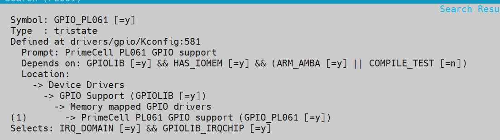

# 从 QEMU 中启动 Mini-Linux

## 如何从 0 开始搭建一个全新的 Linux 系统呢

### 安装编译环境

```shell
sudo apt install qemu-system-arm gcc-aarch64-linux-gnu build-essential bc bison flex libssl-dev libelf-dev cpio
```

### 编译内核

1. 选用 `Linux` 主线开始编译

   ```shell
   cd work
   git clone --depth=1 https://github.com/torvalds/linux.git
   cd linux
   ```

2. 初始化内核编译源码

   ```shell
   make ARCH=arm64 CROSS_COMPILE=aarch64-linux-gnu- defconfig
   ```

3. 在内核中打开 `QEMU` 所需要的相关驱动

   ```shell
   make ARCH=arm64 CROSS_COMPILE=aarch64-linux-gnu- menuconfig
   ```

   在 `Device Driver / Character devices / Serial drivers /`启用` ARM AMBA PL011 serial port support`

   

4. 开始编译内核

   ```shell
   make ARCH=arm64 CROSS_COMPILE=aarch64-linux-gnu- -j$(nproc)
   ```

5. 编译完成后，内核会存放在 `arch/arm64/Image`

### 编译 `busybox`

1. 拉取 `busybox` 主线代码

   ```shell
   cd work
   git clone --depth=1 https://git.busybox.net/busybox
   cd busybox
   ```

2. 创建初始化配置

   ```shell
   make ARCH=arm64 CROSS_COMPILE=aarch64-linux-gnu- defconfig 
   ```

3. 修改编译配置，使`busybox`处于静态而不依赖于`glibc`

   ```shell
   make ARCH=arm64 CROSS_COMPILE=aarch64-linux-gnu- menuconfig
   ```

   启用 `Settings / Build Options - Build static binary (no shared libs)` 

   

4. 编译`busybox`

   ```shell
   make ARCH=arm64 CROSS_COMPILE=aarch64-linux-gnu- -j$(nproc)
   ```

### 组装 `rootfs`

1. 将编译好的 `busybox` 安装到 `rootfs`

   ```shell
   cd work
   mkdir rootfs
   cd busybox
   make ARCH=arm64 CROSS_COMPILE=aarch64-linux-gnu- CONFIG_PREFIX=work/rootfs install
   ```

2. 查看 `rootfs` 的状态

   ```shell
   cd rootfs
   ls
   ```

   此时 `rootfs` 文件夹处于 `busybox` 最简单状态

   ```shell
   root@wzj:~/mini-linux/rootfs# ls -la
   total 8
   drwxr-xr-x 5 root root   75 Sep  1 14:58 .
   drwxr-xr-x 9 root root  155 Sep  1 14:58 ..
   drwxr-xr-x 2 root root 4096 Sep  1 14:58 bin
   lrwxrwxrwx 1 root root   11 Sep  1 14:58 linuxrc -> bin/busybox
   drwxr-xr-x 2 root root 4096 Sep  1 14:58 sbin
   drwxr-xr-x 4 root root   29 Sep  1 14:58 usr
   ```

3. 手动建立系统需要的运行时文件夹

   ```shell
   mkdir -p dev proc sys etc tmp root
   ```

4. 建立`init`

   `init` 进程是内核启动完成后，第一个启动的用户进程

   ```shell
   cd rootfs
   vim init
   ```

   在`init`中写入

   ```shell
   #!/bin/sh
   
   mount -t proc proc /proc
   mount -t sysfs sysfs /sys
   mount -t devtmpfs devtmpfs /dev
   
   hostname wzj-linux
   
   echo
   echo "=============================="
   echo "    theWZJian  Mini Linux"
   echo "=============================="
   echo
   
   ip link set lo up
   ip link set eth0 up
   
   exec /bin/cttyhack /bin/sh
   ```

   并赋予`init`可执行权限

   ```shell
   chmod +x init
   ```

   在工作机上建立的 `rootfs` 在打包后会原样进入虚拟机，包括文件权限配置

5. 将 `rootfs` 载入 `initramfs`

   ```shell
   cd rootfs
   find . -print0 | cpio --null -ov --format=newc | gzip > ../rootfs.cpio.gz
   ```

#### 什么是`initramfs`

`initramfs` 本质上就是一个 **`cpio` 压缩包**，里面放着启动 Linux 所需要的最基本文件，Linux 内核在启动完毕后，会解压该 `cpio`压缩包到内存中，把它作为临时的`/`

之后，内核会执行该临时根目录中的`/init`，由该`init`加载必要驱动，并找到真正的`RootFS`

在把真正的硬盘挂载`mount /dev/sda1 /mnt`后，使用`switch_root`切换根目录，并执行真正 `RootFS:/sbin/init`

### 使用 QEMU 启动最简的 `Linux`

```shell
qemu-system-aarch64 \
    -M virt \
    -cpu cortex-a53 \
    -m 512M \
    -nographic \
    -kernel ~/mini-linux/linux/arch/arm64/boot/Image \
    -initrd ~/mini-linux/rootfs.cpio.gz \
    -append "console=ttyAMA0 rdinit=/init" \
    -netdev user,id=net0 \
    -device virtio-net-pci,netdev=net0
```

启动成功：


## 创建一个真正的 `RootFS`

现在在 `QEMU`关机后，存储的文件都会丢失，因为现在的`initramfs`是解压在内存中的，并不会真正保存信息

因此我们需要创建一个硬盘并挂载

### 在工作机上创建一个硬盘

```shell
cd ~/work
dd if=/dev/zero of=rootfs.ext4 bs=1M count=128
mkfs.ext4 rootfs.ext4
```

现在我们在工作机上挂载这个硬盘，并往其中复制根文件系统

```shell
mkdir -p /tmp/mini-root
sudo mount -o loop rootfs.ext4 /tmp/mini-root
```

### 准备经典 `Linux` 启动流程的`RootFS`

我们需要修改已有的`rootfs`

#### 修改`/init`为启动主文件系统的入口

将`/init`修改为我们需要的挂载主硬盘并启动的逻辑

```shell
#!/bin/sh

mount -t proc proc /proc
mount -t sysfs sysfs /sys
mount -t devtmpfs devtmpfs /dev

echo
echo "============================="
echo "wzj Linux Kernel Init"
echo "ready to start RootFS....."
echo "============================="
echo

# 挂载真正的 rootfs
mount -t ext4 /dev/vda /mnt

# 切换到真正的 rootfs
exec switch_root /mnt /sbin/init
```

#### 创建 `/sbin/init`为主文件系统的`init`

我们可以直接让`busybox`接管`/sbin/init`

```shell
cd rootfs
mkdir sbin
ln -sf /bin/busybox /sbin/init
```

将我们准备的`rootfs`复制进入该文件系统中

```shell
sudo cp -a rootfs/. /tmp/mini-root/
```

然后卸载该`ext4`分区

```shell
umount /tmp/mini-root
```

接着使用 `QEMU`启动

```shell
qemu-system-aarch64
	-M virt
    -cpu cortex-a53
    -m 512M
    -nographic
    -kernel ./linux/arch/arm64/boot/Image
    -initrd ./rootfs.cpio.gz
    -drive file=./rootfs.ext4,format=raw,if=virtio
    -append "console=ttyAMA0 rdinit=/init"

```

### 抛弃 `initramfs`，直接从硬盘启动

其实我们已经做到了，只要

```shell
qemu-system-aarch64
	-M virt 
    -cpu cortex-a53
    -m 512M
    -nographic
    -kernel ./linux/arch/arm64/boot/Image
    -drive file=./rootfs.ext4,format=raw,if=virtio
    -append "console=ttyAMA0 root=/dev/vda rw init=/sbin/init"
```

---

## 加载自己的设备树

### 命令

在 `QEMU` 启动时，可以使用 `-dtb` 选项来加载自己的设备树

```shell
qemu-system-aarch64 \
    -M virt \
    -cpu cortex-a53 \
    -m 512M \
    -nographic \
    -kernel ./linux/arch/arm64/boot/Image \
    -dtb ./my-virt.dtb \
    -drive file=./rootfs.ext4,format=raw,if=virtio \
    -netdev user,id=net0 \
    -device virtio-net-device,netdev=net0 \
    -append "console=ttyAMA0 root=/dev/vda rw init=/sbin/init"
```

### 使用自己的设备树模拟一个 `GPIO` 管脚

###  启用 `QEMU` 中负责 `GPIO` 的驱动

在以前的启动中已经出现了问题，系统在启动时会报错：

`[   11.005240] platform gpio-keys: deferred probe pending: gpio-keys: failed to get gpio`

这说明 `QEMU` 在模拟出了一个硬件层面的`GPIO`管脚，但是无法加载让它——`Linux`缺少对应的驱动

因此我们需要去开启 `GPIO` 控制器的驱动

```shell
cd linux
make ARCH=arm64 CROSS_COMPILE=aarch64-linux-gnu- menuconfig
```

直接 `/` 搜索 `PL061`并开启：


重启虚拟机，发现相关报错消失

#### 查看系统中出现的 `GPIO` 管脚

在虚拟机中，我们可以用下面的方式查看 `GPIO` 管脚

```shell
mount -t debugfs none /sys/kernel/debug
cat /sys/kernel/debug/gpio
```

输出：

```shell
gpiochip0: 8 GPIOs, parent: amba/9030000.pl061, 9030000.pl061:
 gpio-3   (                    |GPIO Key Poweroff   ) in  lo IRQ

```

### 编写设备树接管这个管脚

#### 导出`QEMU`自动生成的设备树

加上 `monitor` 参数启动

```shell
qemu-system-aarch64 \
    -M virt \
    -cpu cortex-a53 \
    -m 512M \
    -nographic \
    -kernel ./linux/arch/arm64/boot/Image \
    -drive file=./rootfs.ext4,format=raw,if=virtio \
    -netdev user,id=net0 \
    -device virtio-net-device,netdev=net0 \
    -append "console=ttyAMA0 root=/dev/vda rw init=/sbin/init" \
    -monitor telnet:127.0.0.1:5555,server=on,wait=off
```

然后使用另一个终端切入：

```shell
telnet 127.0.0.1 5555
(qemu) dumpdtb virt.dtb
(qemu) quit
```

然后反编译这个设备树dtb文件

```shell
dtc -I dtb -O dts -o virt.dts virt.dtb
```

查看设备树中的`GPIO`控制器

```C
pl061@9030000 {
	phandle = <0x8004>;
	clock-names = "apb_pclk";
	clocks = <0x8000>;
	interrupts = <0x00 0x07 0x04>;
	gpio-controller;
	#gpio-cells = <0x02>;
	compatible = "arm,pl061\0arm,primecell";
	reg = <0x00 0x9030000 0x00 0x1000>;
};
```

我们修改该控制器，赋予其别名：
```C
gpio: pl061@9030000 {
	phandle = <0x8004>;
	clock-names = "apb_pclk";
	clocks = <0x8000>;
	interrupts = <0x00 0x07 0x04>;
	gpio-controller;
	#gpio-cells = <0x02>;
	compatible = "arm,pl061\0arm,primecell";
	reg = <0x00 0x9030000 0x00 0x1000>;
};

test_key {
    compatible = "test,key";
    
    // 使用 GPIO 控制器的 0号管脚，定义高电平为 1
    key-gpios = <&gpio 0 GPIO_ACTIVE_HIGH>;
};
```

开始编译，请注意，我们如果使用了`\#include <dt-bindings/gpio/gpio.h>`，则我们需要先用`cpp`来展开宏定义

```shell
cpp -nostdinc \
    -I ~/mini-linux/linux/include \
    -I ~/mini-linux/linux/include/uapi \
    -undef \
    -x assembler-with-cpp \
    -P \
    virt.dts > virt-pre.dts
dtc -I dts \
    -O dtb \
    -o my-virt.dtb \
    virt-pre.dts
```

### 启动 `QEMU`

我们可以使用 `-dtb` 选项来加载自己的设备树

```shell
qemu-system-aarch64 \
    -M virt \
    -cpu cortex-a53 \
    -m 512M \
    -nographic \
    -kernel ./linux/arch/arm64/boot/Image \
    -dtb ./my-virt.dtb \
    -drive file=./rootfs.ext4,format=raw,if=virtio \
    -netdev user,id=net0 \
    -device virtio-net-device,netdev=net0 \
    -append "console=ttyAMA0 root=/dev/vda rw init=/sbin/init"
```

#### 在 `QEMU`中查看节点

```shell
cd /proc/device-tree/test_key/
cat name
```

输出`test_key`，结果正确

### 加载驱动到虚拟机

#### 通过共享目录复制文件

我们可以使用共享目录的方式复制浮动

```shell
mkdir -p ~/mini-linux/share
qemu-system-aarch64 \
    -M virt \
    -cpu cortex-a53 \
    -m 512M \
    -nographic \
    -kernel ./linux/arch/arm64/boot/Image \
    -dtb ./my-virt.dtb \
    -drive file=./rootfs.ext4,format=raw,if=virtio \
    -netdev user,id=net0 \
    -device virtio-net-device,netdev=net0 \
    -append "console=ttyAMA0 root=/dev/vda rw init=/sbin/init" \
    -fsdev local,id=fsdev0,path=$HOME/mini-linux/share,security_model=none \
    -device virtio-9p-pci,fsdev=fsdev0,mount_tag=hostshare
```

在虚拟机中

```shell
mkdir -p /mnt/host
mount -t 9p -o trans=virtio hostshare /mnt/host
```

#### 加载驱动

```shell
cd /mnt/host
insmod input.ko
```

#### 如何在虚拟机外部控制该节点

我们发现几乎没有任何方法控制模拟出的 `GPIO` 管脚，经过探索，我们选择占用 `QEMU` 的外部关机键

##### 修改设备树

我们可以再次修改设备树，令关机键为我们所用

```C
gpio-keys {
    compatible = "gpio-keys";

    // 禁用该关机键
    status = "disable";
    
    poweroff {
        gpios = <0x8004 0x03 0x00>;
        linux,code = <0x74>;
        label = "GPIO Key Poweroff";
    };
    
};

gpio: pl061@9030000 {
    phandle = <0x8004>;
    clock-names = "apb_pclk";
    clocks = <0x8000>;
    interrupts = <0x00 0x07 0x04>;
    gpio-controller;
    #gpio-cells = <0x02>;
    compatible = "arm,pl061\0arm,primecell";
    reg = <0x00 0x9030000 0x00 0x1000>;
};

test_key {
    compatible = "test,key";

    // 使用 GPIO 控制器的 0号管脚，定义高电平为 1
    // 我们修改为 3号管脚，占用关机键
    key-gpios = <&gpio 3 GPIO_ACTIVE_HIGH>;
	status ="okay";
};
```

##### 完整启动命令

```shell
qemu-system-aarch64 \
    -M virt \
    -cpu cortex-a53 \
    -m 512M \
    -nographic \
    -kernel ./linux/arch/arm64/boot/Image \
    -dtb ./my-virt.dtb \
    -drive file=./rootfs.ext4,format=raw,if=virtio \
    -netdev user,id=net0 \
    -device virtio-net-device,netdev=net0 \
    -append "console=ttyAMA0 root=/dev/vda rw init=/sbin/init" \
    -fsdev local,id=fsdev0,path=$HOME/mini-linux/share,security_model=none \
    -device virtio-9p-pci,fsdev=fsdev0,mount_tag=hostshare \
    -monitor telnet:127.0.0.1:5555,server=on,wait=off
```

```shell
mkdir -p /mnt/host
mount -t 9p -o trans=virtio hostshare /mnt/host
```

##### 在外部启动 `GPIO` 按键

在虚拟机启动并装载驱动后，我们可以在外部发起关机中断

```shell
telnet 127.0.0.1 5555
(qemu) system_powerdown
```

##### 内部驱动状态

```shell

/mnt/host # insmod input.ko
[   95.207792] key driver init
[   95.208358] Key driver probe function called
[   95.211595] input: key_input_device as /devices/virtual/input/input0
/mnt/host # [  107.879165] Key IRQ handler called for IRQ 23
[  107.900252] Key shake timer handler called
[  107.900482] Key is still pressed after debounce
[  107.978300] Key IRQ handler called for IRQ 23
[  108.000274] Key shake timer handler called
[  108.000445] Key is still pressed after debounce

/mnt/host #
/mnt/host #
/mnt/host # hex
hexdump  hexedit
/mnt/host # hexdump /dev/input/event0
[  151.354399] Key IRQ handler called for IRQ 23
[  151.376368] Key shake timer handler called
[  151.376825] Key is still pressed after debounce
0000000 0097 0000 0000 0000 a2e3 0005 0000 0000
0000010 0001 001e 0000 0000 0097 0000 0000 0000
0000020 a2e3 0005 0000 0000 0000 0000 0000 0000
[  151.454432] Key IRQ handler called for IRQ 23
[  151.476391] Key shake timer handler called
[  151.476691] Key is still pressed after debounce
0000030 0097 0000 0000 0000 27c6 0007 0000 0000
0000040 0001 001e 0001 0000 0097 0000 0000 0000
0000050 27c6 0007 0000 0000 0000 0000 0000 0000
```


