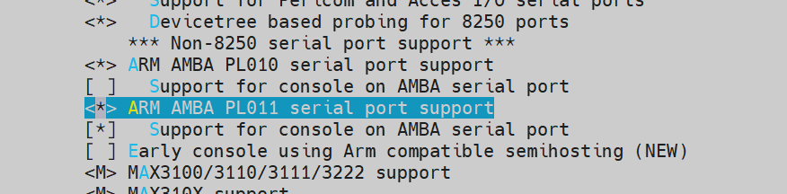
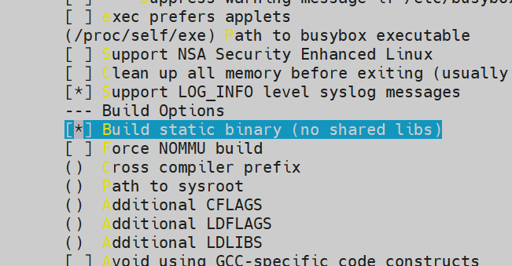
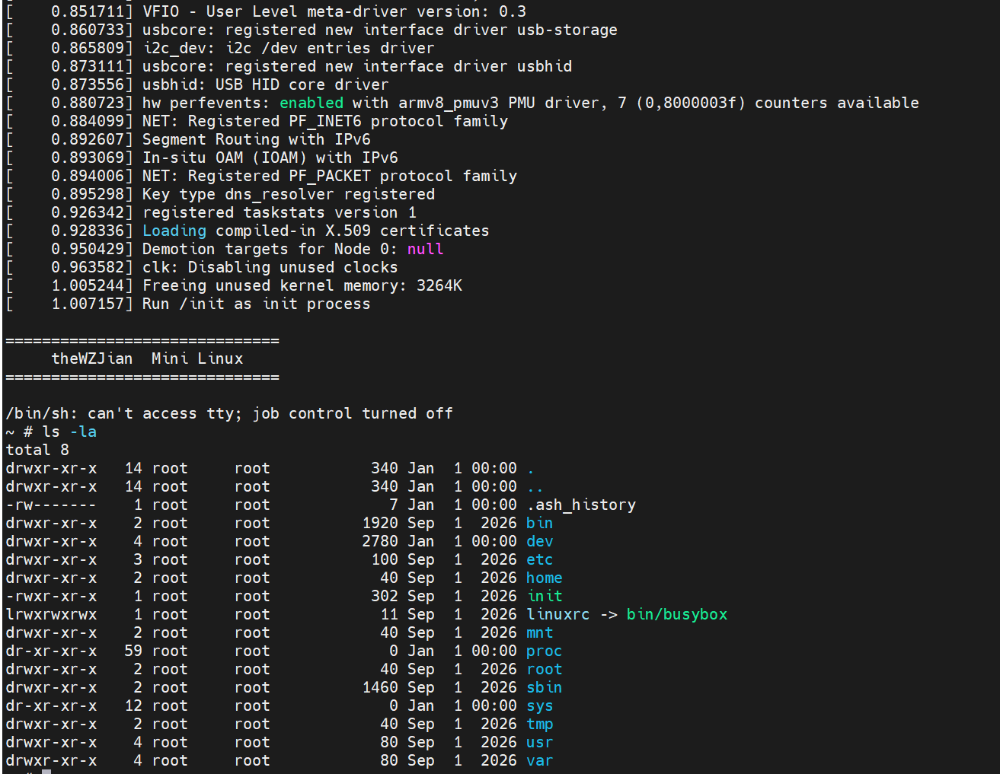

# 从 QEMU 中启动 Mini-Linux

## 如何从 0 开始搭建一个全新的 Linux 系统呢

### 安装编译环境

```shell
sudo apt install qemu-system-arm gcc-aarch64-linux-gnu build-essential bc bison flex libssl-dev libelf-dev cpio
```

### 编译内核

1. 选用 `Linux` 主线开始编译

   ```shell
   cd work
   git clone --depth=1 https://github.com/torvalds/linux.git
   cd linux
   ```

2. 初始化内核编译源码

   ```shell
   make ARCH=arm64 CROSS_COMPILE=aarch64-linux-gnu- defconfig
   ```

3. 在内核中打开 `QEMU` 所需要的相关驱动

   ```shell
   make ARCH=arm64 CROSS_COMPILE=aarch64-linux-gnu- menuconfig
   ```

   在 `Device Driver / Character devices / Serial drivers /`启用` ARM AMBA PL011 serial port support`

   

4. 开始编译内核

   ```shell
   make ARCH=arm64 CROSS_COMPILE=aarch64-linux-gnu- -j$(nproc)
   ```

5. 编译完成后，内核会存放在 `arch/arm64/Image`

### 编译 `busybox`

1. 拉取 `busybox` 主线代码

   ```shell
   cd work
   git clone --depth=1 https://git.busybox.net/busybox
   cd busybox
   ```

2. 创建初始化配置

   ```shell
   make ARCH=arm64 CROSS_COMPILE=aarch64-linux-gnu- defconfig 
   ```

3. 修改编译配置，使`busybox`处于静态而不依赖于`glibc`

   ```shell
   make ARCH=arm64 CROSS_COMPILE=aarch64-linux-gnu- menuconfig
   ```

   启用 `Settings / Build Options - Build static binary (no shared libs)` 

   

4. 编译`busybox`

   ```shell
   make ARCH=arm64 CROSS_COMPILE=aarch64-linux-gnu- -j$(nproc)
   ```

### 组装 `rootfs`

1. 将编译好的 `busybox` 安装到 `rootfs`

   ```shell
   cd work
   mkdir rootfs
   cd busybox
   make ARCH=arm64 CROSS_COMPILE=aarch64-linux-gnu- CONFIG_PREFIX=work/rootfs install
   ```

2. 查看 `rootfs` 的状态

   ```shell
   cd rootfs
   ls
   ```

   此时 `rootfs` 文件夹处于 `busybox` 最简单状态

   ```shell
   root@wzj:~/mini-linux/rootfs# ls -la
   total 8
   drwxr-xr-x 5 root root   75 Sep  1 14:58 .
   drwxr-xr-x 9 root root  155 Sep  1 14:58 ..
   drwxr-xr-x 2 root root 4096 Sep  1 14:58 bin
   lrwxrwxrwx 1 root root   11 Sep  1 14:58 linuxrc -> bin/busybox
   drwxr-xr-x 2 root root 4096 Sep  1 14:58 sbin
   drwxr-xr-x 4 root root   29 Sep  1 14:58 usr
   ```

3. 手动建立系统需要的运行时文件夹

   ```shell
   mkdir -p dev proc sys etc tmp root
   ```

4. 建立`init`

   `init` 进程是内核启动完成后，第一个启动的用户进程

   ```shell
   cd rootfs
   vim init
   ```

   在`init`中写入

   ```shell
   #!/bin/sh
   
   mount -t proc proc /proc
   mount -t sysfs sysfs /sys
   mount -t devtmpfs devtmpfs /dev
   
   hostname wzj-linux
   
   echo
   echo "=============================="
   echo "    theWZJian  Mini Linux"
   echo "=============================="
   echo
   
   ip link set lo up
   ip link set eth0 up
   
   exec /bin/cttyhack /bin/sh
   ```

   并赋予`init`可执行权限

   ```shell
   chmod +x init
   ```

   在工作机上建立的 `rootfs` 在打包后会原样进入虚拟机，包括文件权限配置

5. 将 `rootfs` 载入 `initramfs`

   ```shell
   cd rootfs
   find . -print0 | cpio --null -ov --format=newc | gzip > ../rootfs.cpio.gz
   ```

#### 什么是`initramfs`

`initramfs` 本质上就是一个 **`cpio` 压缩包**，里面放着启动 Linux 所需要的最基本文件，Linux 内核在启动完毕后，会解压该 `cpio`压缩包到内存中，把它作为临时的`/`

之后，内核会执行该临时根目录中的`/init`，由该`init`加载必要驱动，并找到真正的`RootFS`

在把真正的硬盘挂载`mount /dev/sda1 /mnt`后，使用`switch_root`切换根目录，并执行真正 `RootFS:/sbin/init`

### 使用 QEMU 启动最简的 `Linux`

```shell
qemu-system-aarch64 \
    -M virt \
    -cpu cortex-a53 \
    -m 512M \
    -nographic \
    -kernel ~/mini-linux/linux/arch/arm64/boot/Image \
    -initrd ~/mini-linux/rootfs.cpio.gz \
    -append "console=ttyAMA0 rdinit=/init" \
    -netdev user,id=net0 \
    -device virtio-net-pci,netdev=net0
```

启动成功：



## 创建一个真正的 `RootFS`

现在在 `QEMU`关机后，存储的文件都会丢失，因为现在的`initramfs`是解压在内存中的，并不会真正保存信息

因此我们需要创建一个硬盘并挂载

### 在工作机上创建一个硬盘

```shell
cd ~/work
dd if=/dev/zero of=rootfs.ext4 bs=1M count=128
mkfs.ext4 rootfs.ext4
```

现在我们在工作机上挂载这个硬盘，并往其中复制根文件系统

```shell
mkdir -p /tmp/mini-root
sudo mount -o loop rootfs.ext4 /tmp/mini-root
```

### 准备经典 `Linux` 启动流程的`RootFS`

我们需要修改已有的`rootfs`

#### 修改`/init`为启动主文件系统的入口

将`/init`修改为我们需要的挂载主硬盘并启动的逻辑

```shell
#!/bin/sh

mount -t proc proc /proc
mount -t sysfs sysfs /sys
mount -t devtmpfs devtmpfs /dev

echo
echo "============================="
echo "wzj Linux Kernel Init"
echo "ready to start RootFS....."
echo "============================="
echo

# 挂载真正的 rootfs
mount -t ext4 /dev/vda /mnt

# 切换到真正的 rootfs
exec switch_root /mnt /sbin/init
```

#### 创建 `/sbin/init`为主文件系统的`init`

我们可以直接让`busybox`接管`/sbin/init`

```shell
cd rootfs
mkdir sbin
ln -sf /bin/busybox /sbin/init
```

将我们准备的`rootfs`复制进入该文件系统中

```shell
sudo cp -a rootfs/. /tmp/mini-root/
```

然后卸载该`ext4`分区

```shell
umount /tmp/mini-root
```

接着使用 `QEMU`启动

```shell
qemu-system-aarch64
	-M virt
    -cpu cortex-a53
    -m 512M
    -nographic
    -kernel ./linux/arch/arm64/boot/Image
    -initrd ./rootfs.cpio.gz
    -drive file=./rootfs.ext4,format=raw,if=virtio
    -append "console=ttyAMA0 rdinit=/init"

```

### 抛弃 `initramfs`，直接从硬盘启动

其实我们已经做到了，只要

```shell
qemu-system-aarch64
	-M virt 
    -cpu cortex-a53
    -m 512M
    -nographic
    -kernel ./linux/arch/arm64/boot/Image
    -drive file=./rootfs.ext4,format=raw,if=virtio
    -append "console=ttyAMA0 root=/dev/vda rw init=/sbin/init"
```

